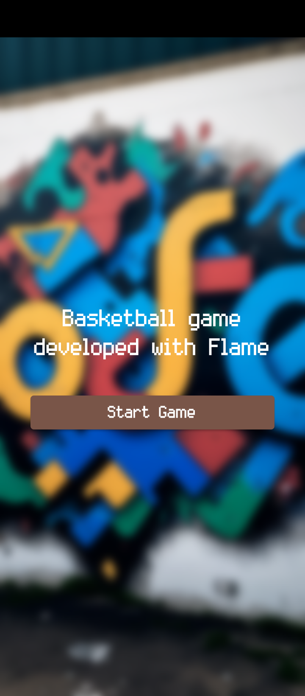
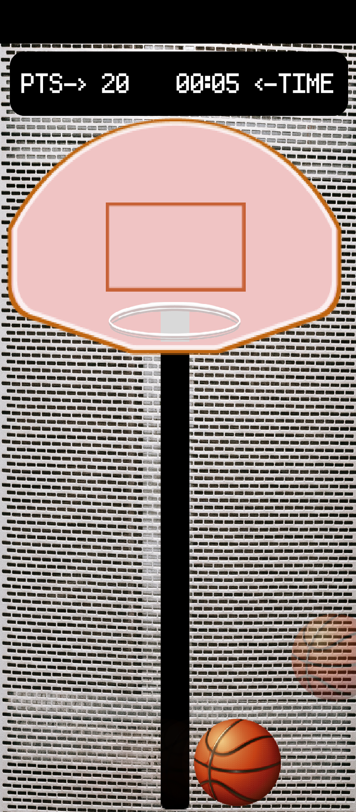
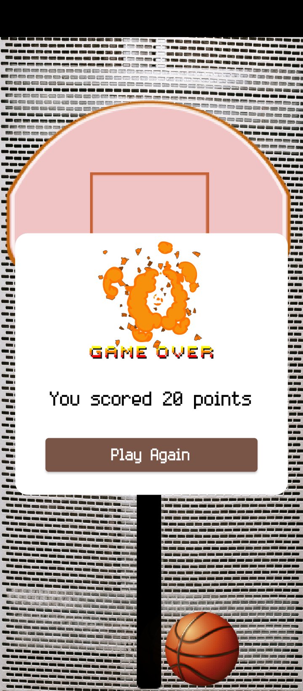

# basketball_game
Basketball game developed with Flame (Flutter)

## Screen record
https://drive.google.com/file/d/19BwdKHWQOVWFrjt9bHTiqCo3EuhVkSAf/view?usp=share_link

## Screenshots

| 1                                              | 2                                         |
|------------------------------------------------|-------------------------------------------|
|  |  |
| 3                                              | 4                                         |
|       |  |
| 5                                              |                                           |
|       |                                           |

**Step 1**

Download or clone this repo by using the link below
```
https://github.com/enoch-aik/basketball_game.git
```

**Step 2**

Go to project root and execute the following command in console to get the required dependencies:

```
flutter pub get
```

## Hide Generated Files

In-order to hide generated files, navigate to `Android Studio` -> `Preferences` -> `Editor` -> `File Types` and paste the below lines under `ignore files and folders` section:

## Getting Started

This project is a starting point for a Flutter application.

A few resources to get you started if this is your first Flutter project:

- [Lab: Write your first Flutter app](https://docs.flutter.dev/get-started/codelab)
- [Cookbook: Useful Flutter samples](https://docs.flutter.dev/cookbook)

For help getting started with Flutter development, view the
[online documentation](https://docs.flutter.dev/), which offers tutorials,
samples, guidance on mobile development, and a full API reference.
